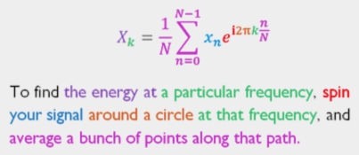

# MathJax多彩方程式

Stuart Riffle写下了一个关于傅里叶方程的精彩解释。在他的展示中有很多很棒的视觉效果，但高潮是他关于离散傅里叶逆变换公式的转换。

多棒的展示啊！我的第一个想法是更多的公式应该有像这样的关注读者理解力的优雅的解释。我非常乐意能用这种方式创造清晰的公式：

$$\textcolor{Purple}{X}_\textcolor{Green}{k}
=\textcolor{Magenta}{\frac{1}{N}\sum_{n=0}^{N-1}}
\textcolor{Blue}{x_n}
\textcolor{Red}{e}^
{\textcolor{Red}{i}\textcolor{Orange}{2\pi} 
\textcolor{Green}{k}
\textcolor{Magenta}{\frac{n}{N}}
}.$$

**为了发现特定频率下的 能量 , 根据频率 旋转 你的信号 一圈, 并且沿着该路径平均分配一束点。**

**Remark:**

1. Html color setting  
		Blue 
		 Brown 
		 Cyan 
		 Green 
		 Grey 
		 Magenta 
		 Orange 
		 Yellow 
		 Purple 
2. The raw equation is $$X_k=\frac{1}{N}\sum_{n=0}^{N-1}x_ne^{i2\pi k \frac{n}{N}}.$$
3. Reference: [Colorful Equations With MathJax](http://adereth.github.io/blog/2013/11/29/colorful-equations/)